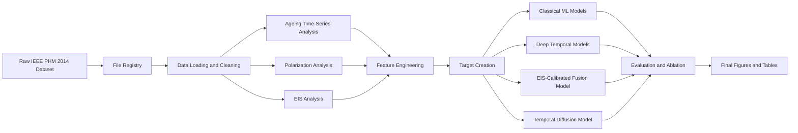
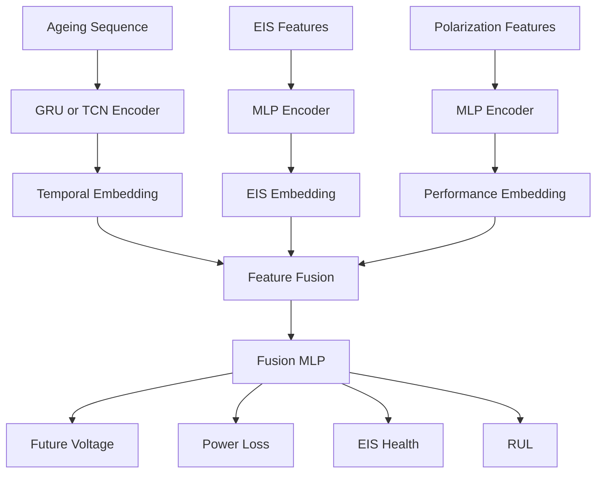

# EIS-Calibrated Deep Temporal Prognostics for PEM Fuel Cell Degradation and Remaining Useful Life Prediction

<p align="center">
  <b>End-to-end PEM fuel cell prognostics pipeline using ageing time-series data, polarization curves, and Electrochemical Impedance Spectroscopy.</b>
</p>

<p align="center">
  
  
  
  
  
</p>

---

## Overview

This repository develops a complete data-driven prognostics workflow for **Proton Exchange Membrane Fuel Cell degradation**.

The project uses the **IEEE PHM Data Challenge 2014** dataset to estimate fuel cell health and predict future degradation. The dataset contains three complementary data sources:

* ageing monitoring time-series,
* polarization curves,
* Electrochemical Impedance Spectroscopy data.

The central idea is to use **EIS-calibrated deep temporal models** to improve degradation forecasting and Remaining Useful Life prediction.

---

## Project Goal

Fuel cell degradation is difficult to predict because no single measurement fully describes the health of the stack.

This project combines:

| Source              | What it captures                                     | Why it matters                                             |
| ------------------- | ---------------------------------------------------- | ---------------------------------------------------------- |
| Ageing time-series  | Long-term operating behaviour                        | Shows voltage drop, operating drift, and degradation trend |
| Polarization curves | Static performance under different current densities | Used to calculate power loss and power-based SoH           |
| EIS data            | Internal electrochemical impedance behaviour         | Reveals hidden physical degradation indicators             |

The goal is to answer one main question:

> Can EIS and polarization information improve PEMFC degradation and RUL prediction compared with voltage-only time-series models?

---

## Dataset

This project uses the public **IEEE PHM Data Challenge 2014** dataset.

Dataset page:

[IEEE PHM Data Challenge 2014 — dataUBFC](https://search-data.ubfc.fr/FR-18008901306731-2021-07-19_IEEE-PHM-Data-Challenge-2014.html)

DOI:

[10.25666/DATAUBFC-2021-07-19](https://dx.doi.org/doi:10.25666/DATAUBFC-2021-07-19)

Dataset file:

```text
FC1_FC2_Excel.zip
```

The dataset contains two PEM fuel cell ageing experiments:

| Dataset               | Operating condition                                           | Role             |
| --------------------- | ------------------------------------------------------------- | ---------------- |
| `FC1_Without_Ripples` | Stationary current operation without ripples                  | Learning dataset |
| `FC2_With_Ripples`    | Dynamic current operation with high-frequency current ripples | Testing dataset  |

The fuel cell stacks are 5-cell PEMFC stacks. Each cell has an active area of 100 cm². The nominal operating current density is 0.70 A/cm².

---

## Prediction Tasks

The project follows the two main tasks of the IEEE PHM 2014 challenge and extends them into a complete modelling pipeline.

### 1. State of Health Estimation

The SoH task is linked to EIS behaviour.

The objective is to estimate health-related impedance characteristics:

```text
ReZ and ImZ
```

at selected frequencies and future ageing times.

In this project, EIS data is also transformed into health features such as:

* high-frequency resistance,
* low-frequency impedance,
* Nyquist arc width,
* Nyquist arc area,
* maximum negative imaginary impedance,
* impedance at selected frequencies.

---

### 2. Remaining Useful Life Prediction

The RUL task predicts the remaining time before the fuel cell reaches a defined power-loss threshold.

The power-loss thresholds are:

```text
3.5%, 4.0%, 4.5%, 5.0%, 5.5%
```

The challenge prediction point is:

```text
tpred = 550 h
```

In this project, RUL targets are created from power-loss evolution and used for classical ML, deep temporal models, fusion models, and uncertainty-aware forecasting.

---

## Method Summary



---

## Repository Structure

```text
pemfc_prognostics/
│
├── data/
│   ├── raw/
│   │   ├── FC1_Without_Ripples/
│   │   └── FC2_With_Ripples/
│   │
│   ├── processed/
│   │   ├── ageing/
│   │   ├── eis/
│   │   ├── polarization/
│   │   └── features/
│   │
│   └── outputs/
│       ├── figures/
│       ├── tables/
│       └── models/
│
├── notebooks/
│   ├── 00_file_registry.ipynb
│   ├── 01_ageing_timeseries_eda.ipynb
│   ├── 02_polarization_eda.ipynb
│   ├── 03_eis_eda.ipynb
│   ├── 04_feature_engineering.ipynb
│   ├── 05_target_creation_rul.ipynb
│   ├── 06_baseline_models.ipynb
│   ├── 07_classical_ml_models.ipynb
│   ├── 08_lstm_gru_models.ipynb
│   ├── 09_tcn_transformer_models.ipynb
│   ├── 10_eis_fusion_model.ipynb
│   ├── 11_temporal_diffusion.ipynb
│   └── 12_final_results_figures.ipynb
│
├── src/
│   ├── config.py
│   ├── data_loader.py
│   ├── file_registry.py
│   ├── preprocessing.py
│   ├── feature_engineering.py
│   ├── target_creation.py
│   ├── plotting.py
│   ├── evaluation.py
│   ├── models_ml.py
│   ├── models_deep.py
│   ├── models_fusion.py
│   └── models_diffusion.py
│
├── requirements.txt
└── README.md
```

---

## Project Roadmap

| Stage | Notebook                          | Goal                                                                | Status  |
| ----- | --------------------------------- | ------------------------------------------------------------------- | ------- |
| 1     | `00_file_registry.ipynb`          | Scan raw files and build metadata registry                          | Planned |
| 2     | `01_ageing_timeseries_eda.ipynb`  | Explore voltage, current, temperature, pressure, flow, and humidity | Planned |
| 3     | `02_polarization_eda.ipynb`       | Analyze performance curves and calculate power loss                 | Planned |
| 4     | `03_eis_eda.ipynb`                | Plot Nyquist curves and extract EIS health indicators               | Planned |
| 5     | `04_feature_engineering.ipynb`    | Create degradation, EIS, polarization, and operating features       | Planned |
| 6     | `05_target_creation_rul.ipynb`    | Create voltage, SoH, power-loss, and RUL targets                    | Planned |
| 7     | `06_baseline_models.ipynb`        | Train simple baseline models                                        | Planned |
| 8     | `07_classical_ml_models.ipynb`    | Train classical ML models                                           | Planned |
| 9     | `08_lstm_gru_models.ipynb`        | Train LSTM and GRU sequence models                                  | Planned |
| 10    | `09_tcn_transformer_models.ipynb` | Train TCN and Transformer models                                    | Planned |
| 11    | `10_eis_fusion_model.ipynb`       | Train EIS-calibrated fusion model                                   | Planned |
| 12    | `11_temporal_diffusion.ipynb`     | Generate uncertainty-aware degradation trajectories                 | Planned |
| 13    | `12_final_results_figures.ipynb`  | Create final figures, tables, and comparison results                | Planned |

---

## Data Processing Stages

### Stage 1 — File Registry

The file registry scans the raw dataset and identifies:

* fuel cell stack: `FC1` or `FC2`,
* data type: ageing, polarization, or EIS,
* ageing checkpoint time,
* EIS current level,
* pre-polarization or post-polarization state,
* file path.

Output:

```text
data/processed/file_registry.csv
```

This registry becomes the central index for the full pipeline.

---

### Stage 2 — Ageing Time-Series Analysis

The ageing files are used to study continuous degradation over time.

Main signals:

* total stack voltage,
* individual cell voltages,
* current and current density,
* hydrogen, air, and cooling-water temperatures,
* hydrogen and air pressures,
* hydrogen and air flows,
* cooling-water flow,
* air humidity,
* cell voltage imbalance.

Outputs:

```text
data/processed/ageing/
data/outputs/figures/ageing_voltage_plot.png
data/outputs/figures/cell_imbalance_plot.png
```

---

### Stage 3 — Polarization Analysis

Polarization curves describe how voltage and power change with current density.

This stage extracts:

* voltage at fixed current densities,
* power at fixed current densities,
* maximum power,
* power loss relative to the initial state,
* power-based State of Health.

Outputs:

```text
data/processed/polarization/polarization_features.csv
data/processed/polarization/power_loss_targets.csv
data/outputs/figures/polarization_curves_over_ageing.png
data/outputs/figures/power_loss_over_time.png
```

---

### Stage 4 — EIS Analysis

EIS data is used to describe internal electrochemical health.

This stage plots and analyzes:

* Nyquist curves,
* real impedance over frequency,
* imaginary impedance over frequency,
* EIS evolution across ageing checkpoints.

Extracted features:

* high-frequency resistance,
* low-frequency impedance,
* maximum negative imaginary impedance,
* frequency at maximum negative imaginary impedance,
* Nyquist arc width,
* Nyquist arc area,
* selected-frequency impedance values.

Outputs:

```text
data/processed/eis/eis_features.csv
data/outputs/figures/nyquist_over_ageing.png
data/outputs/figures/eis_feature_trends.png
```

---

## Feature Engineering

The final feature table combines information from ageing, polarization, and EIS data.

| Feature group         | Examples                                                                                             |
| --------------------- | ---------------------------------------------------------------------------------------------------- |
| Time-series features  | voltage mean, voltage slope, voltage drop, rolling standard deviation, cell imbalance                |
| Operating features    | current stability, temperature statistics, pressure statistics, flow statistics, humidity statistics |
| Polarization features | voltage at fixed current density, power at fixed current density, maximum power, power loss, SoH     |
| EIS features          | HFR, LFR, arc width, arc area, max `-ImZ`, selected-frequency `ReZ/ImZ`                              |

Outputs:

```text
data/processed/features/checkpoint_features.csv
data/processed/features/sequence_dataset.npz
```

---

## Target Creation

The project creates supervised learning targets for degradation and lifetime prediction.

Main targets:

```text
future voltage
future voltage drop
power loss
power-based SoH
EIS health indicator
RUL_3.5
RUL_4.0
RUL_4.5
RUL_5.0
RUL_5.5
```

RUL is defined as the remaining time until a selected power-loss threshold is reached.

Outputs:

```text
data/processed/features/targets_voltage.csv
data/processed/features/targets_power_loss.csv
data/processed/features/targets_rul.csv
```

---

## Models

The modelling pipeline moves from simple baselines to advanced uncertainty-aware models.

### 1. Baseline and Classical Machine Learning

Classical models provide interpretable and reproducible baselines.

Models:

* Linear Regression,
* Polynomial Regression,
* Random Forest,
* XGBoost,
* LightGBM,
* Support Vector Regression,
* Gaussian Process Regression.

Ablation experiments:

| Experiment | Input features                  |
| ---------- | ------------------------------- |
| A          | Voltage only                    |
| B          | Voltage + operating variables   |
| C          | Voltage + EIS features          |
| D          | Voltage + polarization features |
| E          | Voltage + EIS + polarization    |

Outputs:

```text
data/outputs/tables/ml_model_results.csv
data/outputs/tables/ablation_results.csv
```

---

### 2. Deep Temporal Models

Deep models learn degradation patterns directly from ageing sequences.

Models:

* RNN,
* LSTM,
* GRU,
* Temporal Convolutional Network,
* Transformer.

Input sequence:

```text
[Utot, U1-U5, I, J, temperatures, pressures, flows, humidity]
```

Prediction outputs:

```text
future voltage trajectory
future voltage drop
future power loss
RUL
```

Outputs:

```text
data/outputs/tables/deep_model_results.csv
data/outputs/figures/lstm_predictions.png
data/outputs/figures/gru_predictions.png
data/outputs/figures/tcn_predictions.png
data/outputs/figures/transformer_predictions.png
```

GRU and TCN are expected to be strong initial deep-learning baselines for this dataset because they can model temporal degradation while remaining more stable than large Transformer architectures on small datasets.

---

### 3. EIS-Calibrated Fusion Model

This is the main advanced model of the project.

The model combines three information streams:

```text
ageing monitoring sequence
+ EIS health features
+ polarization performance features
```

Architecture:



The fusion model is trained with a multi-task objective:

```python
total_loss = (
    lambda_voltage * voltage_loss
    + lambda_power * power_loss_loss
    + lambda_eis * eis_health_loss
    + lambda_rul * rul_loss
)
```

Outputs:

```text
data/outputs/tables/fusion_model_results.csv
data/outputs/figures/multitask_predictions.png
```

---

### 4. Temporal Diffusion and Uncertainty

The temporal diffusion model extends the project from deterministic prediction to probabilistic forecasting.

Instead of predicting one future degradation curve, it generates multiple possible future trajectories.

This enables:

* mean future degradation forecast,
* uncertainty bands,
* RUL distribution,
* probability of crossing a failure threshold.

Outputs:

```text
data/outputs/figures/diffusion_generated_trajectories.png
data/outputs/figures/rul_distribution.png
data/outputs/figures/uncertainty_band.png
```

---

## Minimum and Advanced Versions

### Minimum Working Version

The minimum complete version includes:

1. file registry,
2. ageing time-series analysis,
3. polarization analysis,
4. EIS analysis,
5. feature engineering,
6. target creation,
7. classical machine learning models,
8. one deep temporal model such as GRU or TCN.

This version is enough to build a meaningful SoH and RUL prediction pipeline.

### Full Advanced Version

The full version adds:

1. EIS-calibrated fusion model,
2. multi-task prediction,
3. temporal diffusion,
4. uncertainty-aware degradation trajectories,
5. RUL distributions,
6. final paper-quality figures and tables.

---

## Environment

This project was developed with:

```text
Python 3.13.9
```

The full environment is stored in:

```text
requirements.txt
```

Major libraries:

| Category             | Libraries                                    |
| -------------------- | -------------------------------------------- |
| Data handling        | `numpy`, `pandas`, `pyarrow`, `openpyxl`     |
| Scientific computing | `scipy`, `statsmodels`, `numba`              |
| Visualization        | `matplotlib`                                 |
| Classical ML         | `scikit-learn`, `xgboost`, `lightgbm`        |
| Deep learning        | `torch`, `pytorch-lightning`, `torchmetrics` |
| Experiment tuning    | `optuna`                                     |
| Explainability       | `shap`                                       |
| Experiment tracking  | `mlflow`                                     |
| Utilities            | `tqdm`, `PyYAML`, `python-dotenv`, `joblib`  |

Main tested versions:

```text
numpy==2.4.6
pandas==2.3.3
scipy==1.17.1
scikit-learn==1.9.0
matplotlib==3.10.9
pyarrow==24.0.0
openpyxl==3.1.5
xgboost==3.2.0
lightgbm==4.6.0
torch==2.12.0
pytorch-lightning==2.6.5
torchmetrics==1.9.0
optuna==4.9.0
shap==0.52.0
mlflow==3.13.0
statsmodels==0.14.6
numba==0.65.1
```

---

## Installation

Create and activate a virtual environment.

### Windows

```bash
python -m venv pemfc_venv
pemfc_venv\Scripts\activate
```

### Linux / macOS

```bash
python -m venv pemfc_venv
source pemfc_venv/bin/activate
```

Install dependencies:

```bash
pip install -r requirements.txt
```

Check the Python version:

```bash
python -V
```

Expected:

```text
Python 3.13.9
```

---

## Data Setup

Download the dataset from:

[IEEE PHM Data Challenge 2014 — dataUBFC](https://search-data.ubfc.fr/FR-18008901306731-2021-07-19_IEEE-PHM-Data-Challenge-2014.html)

Place the extracted dataset in:

```text
data/raw/
```

Expected raw data structure:

```text
data/raw/
├── FC1_Without_Ripples/
└── FC2_With_Ripples/
```

Raw data is not tracked in Git by default.

---

## How to Run

Start Jupyter:

```bash
jupyter notebook
```

Run the notebooks in numerical order:

```text
00_file_registry.ipynb
01_ageing_timeseries_eda.ipynb
02_polarization_eda.ipynb
03_eis_eda.ipynb
04_feature_engineering.ipynb
05_target_creation_rul.ipynb
06_baseline_models.ipynb
07_classical_ml_models.ipynb
08_lstm_gru_models.ipynb
09_tcn_transformer_models.ipynb
10_eis_fusion_model.ipynb
11_temporal_diffusion.ipynb
12_final_results_figures.ipynb
```

Each notebook uses outputs generated by earlier stages.

---

## Expected Outputs

### Processed Data

```text
data/processed/file_registry.csv
data/processed/ageing/
data/processed/eis/
data/processed/polarization/
data/processed/features/
```

### Tables

```text
data/outputs/tables/ml_model_results.csv
data/outputs/tables/ablation_results.csv
data/outputs/tables/deep_model_results.csv
data/outputs/tables/fusion_model_results.csv
```

### Figures

```text
data/outputs/figures/ageing_voltage_plot.png
data/outputs/figures/cell_imbalance_plot.png
data/outputs/figures/polarization_curves_over_ageing.png
data/outputs/figures/power_loss_over_time.png
data/outputs/figures/nyquist_over_ageing.png
data/outputs/figures/eis_feature_trends.png
data/outputs/figures/model_predictions.png
data/outputs/figures/uncertainty_band.png
data/outputs/figures/rul_distribution.png
```

### Models

```text
data/outputs/models/
```

---

## Evaluation

Regression models are evaluated using:

| Metric    | Meaning                                  |
| --------- | ---------------------------------------- |
| MAE       | Mean Absolute Error                      |
| RMSE      | Root Mean Squared Error                  |
| R²        | Explained variance                       |
| MAPE      | Relative percentage error                |
| RUL error | Error in predicted remaining useful life |

Uncertainty-aware models are evaluated using:

| Metric                       | Meaning                                             |
| ---------------------------- | --------------------------------------------------- |
| Prediction interval coverage | How often true values fall inside uncertainty bands |
| Prediction interval width    | Sharpness of uncertainty estimates                  |
| RUL distribution error       | Accuracy of predicted lifetime distribution         |

---

## Reproducibility

Recommended practices:

* keep notebooks numbered and run them in order,
* save train/test splits,
* use fixed random seeds,
* save feature tables,
* save model metrics as CSV files,
* save final figures in `data/outputs/figures/`,
* track code and notebooks, but not large datasets or model binaries.

Example seed:

```python
RANDOM_STATE = 42
```

---

## Data and Git Notes

Recommended to track:

```text
README.md
requirements.txt
src/
notebooks/
small sample data if allowed
```

Recommended to ignore:

```text
data/raw/
data/processed/
data/outputs/models/
large CSV or Excel files
model checkpoints
virtual environments
secrets or tokens
```

---

## Citation

Dataset citation:

```text
Fabien Harel (2021). IEEE PHM Data Challenge 2014. dataUBFC.
DOI: 10.25666/DATAUBFC-2021-07-19
```

Dataset page:

```text
https://search-data.ubfc.fr/FR-18008901306731-2021-07-19_IEEE-PHM-Data-Challenge-2014.html
```

---

## Summary

This repository builds an EIS-calibrated deep temporal prognostics pipeline for PEM fuel cell degradation and Remaining Useful Life prediction.

The workflow starts from raw ageing, polarization, and EIS data, creates degradation and lifetime targets, compares classical and deep learning models, and extends the pipeline toward EIS-based fusion and uncertainty-aware temporal diffusion.
