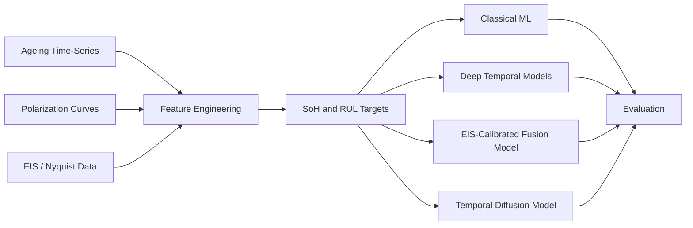
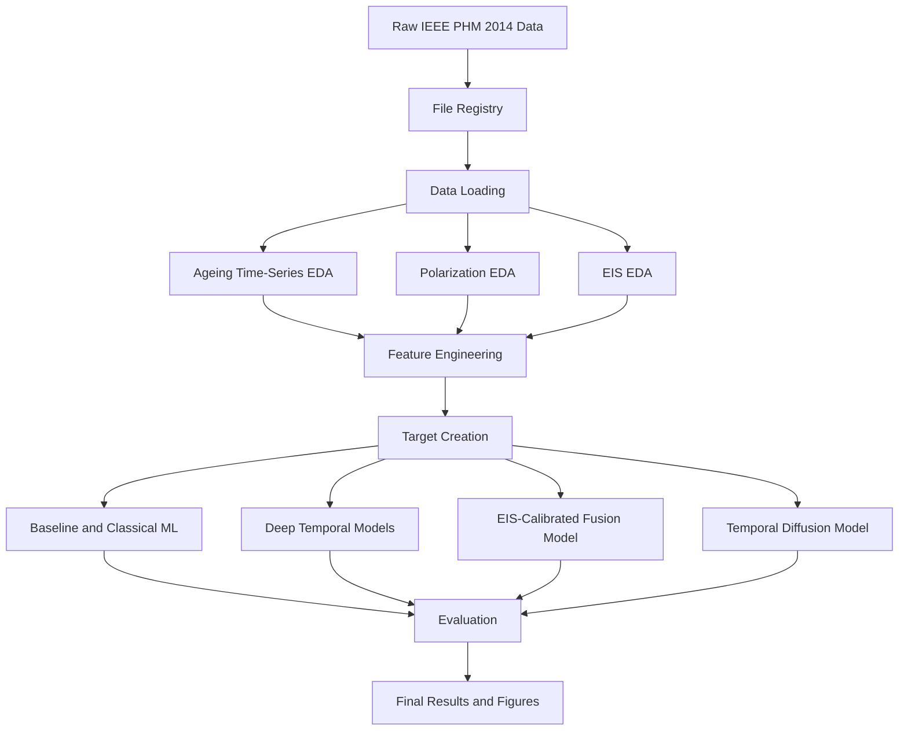
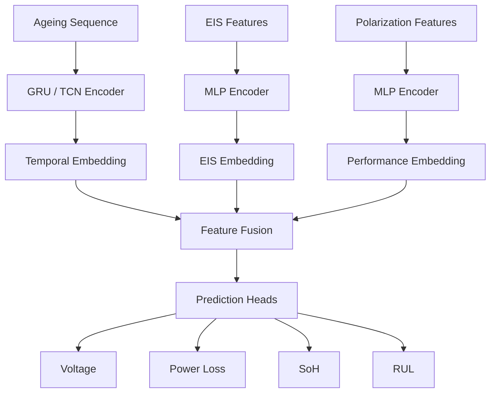

# EIS-Calibrated Deep Temporal Prognostics for PEM Fuel Cell Degradation and Remaining Useful Life Prediction

<p align="center">
  <b>Machine learning and deep temporal modelling pipeline for PEM fuel cell degradation, State of Health estimation, and Remaining Useful Life prediction.</b>
</p>

<p align="center">
  
  
  
  
</p>

---

## Overview

This repository develops a complete prognostics pipeline for **Proton Exchange Membrane Fuel Cell degradation analysis**.

The project uses the **IEEE PHM 2014 Fuel Cell Data Challenge dataset**, which contains ageing monitoring data, polarization curves, and Electrochemical Impedance Spectroscopy data from PEM fuel cell durability tests.

The goal is to use these data sources to estimate fuel cell health and predict degradation progression.

Main prediction targets:

* State of Health
* Remaining Useful Life
* future voltage degradation
* power loss
* EIS-based internal health indicators
* uncertainty-aware future degradation trajectories

---

## Why This Project Uses EIS, Time-Series, and Polarization Data

PEM fuel cell degradation is not fully visible from a single signal.

| Data Type           | What it Represents                                                | Why it is Useful                                          |
| ------------------- | ----------------------------------------------------------------- | --------------------------------------------------------- |
| Ageing time-series  | Voltage, current, temperature, pressure, flow, humidity over time | Shows long-term operating behaviour and degradation trend |
| Polarization curves | Voltage and power behaviour over current density                  | Provides performance loss and power-based SoH targets     |
| EIS data            | Real and imaginary impedance over frequency                       | Reveals internal electrochemical changes inside the stack |

The key idea is to use EIS as a calibration signal for temporal degradation models.



---

## Dataset

The project is based on the **IEEE PHM 2014 Data Challenge** fuel cell dataset.

Two fuel cell ageing experiments are used:

| Dataset               | Operating Condition                         | Role             |
| --------------------- | ------------------------------------------- | ---------------- |
| `FC1_Without_Ripples` | Stationary current operation                | Learning dataset |
| `FC2_With_Ripples`    | Dynamic current with high-frequency ripples | Testing dataset  |

The fuel cell stacks are 5-cell PEMFC stacks. The nominal current density is 0.70 A/cm².

The dataset contains three main file types:

| File Type          | Example Information                                                                |
| ------------------ | ---------------------------------------------------------------------------------- |
| Ageing files       | Time, cell voltages, stack voltage, current, temperature, pressure, flow, humidity |
| Polarization files | Cell voltages, stack voltage, current, current density                             |
| EIS files          | Frequency, real impedance, imaginary impedance                                     |

---

## Challenge Tasks

The original challenge defines two main tasks.

### 1. State of Health Estimation

Predict EIS-based health characteristics for FC2 at future ageing times.

The target is to estimate:

```text
ReZ and ImZ
```

at selected frequencies and future times.

This project extends that idea by using EIS features as health indicators for machine learning and deep temporal models.

---

### 2. Remaining Useful Life Prediction

Predict the remaining time before a given power-loss threshold is reached.

RUL is estimated for these power-loss thresholds:

```text
3.5%, 4.0%, 4.5%, 5.0%, 5.5%
```

The RUL prediction point is:

```text
tpred = 550 h
```

---

## Repository Structure

```text
pemfc_prognostics/
│
├── data/
│   ├── raw/
│   │   ├── FC1_Without_Ripples/
│   │   └── FC2_With_Ripples/
│   │
│   ├── processed/
│   │   ├── ageing/
│   │   ├── eis/
│   │   ├── polarization/
│   │   └── features/
│   │
│   └── outputs/
│       ├── figures/
│       ├── tables/
│       └── models/
│
├── notebooks/
│   ├── 00_file_registry.ipynb
│   ├── 01_ageing_timeseries_eda.ipynb
│   ├── 02_polarization_eda.ipynb
│   ├── 03_eis_eda.ipynb
│   ├── 04_feature_engineering.ipynb
│   ├── 05_target_creation_rul.ipynb
│   ├── 06_baseline_models.ipynb
│   ├── 07_classical_ml_models.ipynb
│   ├── 08_lstm_gru_models.ipynb
│   ├── 09_tcn_transformer_models.ipynb
│   ├── 10_eis_fusion_model.ipynb
│   ├── 11_temporal_diffusion.ipynb
│   └── 12_final_results_figures.ipynb
│
├── src/
│   ├── config.py
│   ├── data_loader.py
│   ├── file_registry.py
│   ├── preprocessing.py
│   ├── feature_engineering.py
│   ├── target_creation.py
│   ├── plotting.py
│   ├── evaluation.py
│   ├── models_ml.py
│   ├── models_deep.py
│   ├── models_fusion.py
│   └── models_diffusion.py
│
├── requirements.txt
└── README.md
```

---

## Workflow

The project is organized as a step-by-step pipeline.



---

## Project Stages

| Stage | Notebook                          | Purpose                                                                    |
| ----- | --------------------------------- | -------------------------------------------------------------------------- |
| 1     | `00_file_registry.ipynb`          | Scan all files and create a structured file registry                       |
| 2     | `01_ageing_timeseries_eda.ipynb`  | Explore voltage, current, temperature, pressure, flow, and humidity trends |
| 3     | `02_polarization_eda.ipynb`       | Analyze polarization curves and calculate power loss                       |
| 4     | `03_eis_eda.ipynb`                | Plot Nyquist curves and extract EIS health indicators                      |
| 5     | `04_feature_engineering.ipynb`    | Create ageing, polarization, and EIS features                              |
| 6     | `05_target_creation_rul.ipynb`    | Create SoH, power-loss, voltage, and RUL targets                           |
| 7     | `06_baseline_models.ipynb`        | Train simple baseline models                                               |
| 8     | `07_classical_ml_models.ipynb`    | Train Random Forest, XGBoost, SVR, Gaussian Process, and related models    |
| 9     | `08_lstm_gru_models.ipynb`        | Train LSTM and GRU models                                                  |
| 10    | `09_tcn_transformer_models.ipynb` | Train TCN and Transformer models                                           |
| 11    | `10_eis_fusion_model.ipynb`       | Combine ageing, EIS, and polarization features                             |
| 12    | `11_temporal_diffusion.ipynb`     | Generate future degradation trajectories with uncertainty                  |
| 13    | `12_final_results_figures.ipynb`  | Create final result tables and figures                                     |

---

## Feature Engineering

The feature table is built by combining information from all available data sources.

### Ageing Time-Series Features

Examples:

* stack voltage trend
* individual cell voltage trends
* voltage drop
* cell imbalance
* rolling voltage variation
* current stability
* temperature statistics
* pressure statistics
* flow statistics
* humidity statistics

### Polarization Features

Examples:

* voltage at fixed current density
* power at fixed current density
* maximum power
* power loss
* power-based SoH

### EIS Features

Examples:

* high-frequency resistance
* low-frequency impedance
* Nyquist arc width
* Nyquist arc area
* maximum negative imaginary impedance
* impedance at selected frequencies
* PCA-based EIS features

---

## Prediction Targets

The project creates several targets for supervised learning.

| Target         | Meaning                                                 |
| -------------- | ------------------------------------------------------- |
| Future voltage | Voltage at a future ageing time                         |
| Voltage drop   | Reduction in voltage over time                          |
| Power loss     | Loss of power relative to the initial state             |
| SoH            | Health state based on power, voltage, or EIS indicators |
| RUL            | Remaining time before a power-loss threshold is reached |

---

## Models

The project compares three levels of modelling.

### 1. Classical Machine Learning

Used as interpretable baselines.

Models include:

* Linear Regression
* Random Forest
* XGBoost
* LightGBM
* Support Vector Regression
* Gaussian Process Regression

---

### 2. Deep Temporal Models

Used to learn degradation patterns from ageing sequences.

Models include:

* RNN
* LSTM
* GRU
* Temporal Convolutional Network
* Transformer

---

### 3. EIS-Calibrated Fusion Model

This is the main modelling direction of the project.

The model combines:

```text
ageing time-series sequence
+ EIS health features
+ polarization performance features
```

and predicts:

```text
future voltage
power loss
State of Health
Remaining Useful Life
```



---

### 4. Temporal Diffusion Model

The temporal diffusion model is used for uncertainty-aware forecasting.

Instead of predicting only one future degradation curve, it generates many possible future trajectories.

This allows estimation of:

* average future degradation,
* uncertainty band,
* RUL distribution,
* probability of crossing a failure threshold.

---

## Model Comparison

To understand the value of each data source, the project compares different feature combinations.

| Experiment | Input Features                  |
| ---------- | ------------------------------- |
| A          | Voltage only                    |
| B          | Voltage + operating variables   |
| C          | Voltage + EIS features          |
| D          | Voltage + polarization features |
| E          | Voltage + EIS + polarization    |

This directly tests whether EIS and polarization information improve prediction compared with ageing time-series data alone.

---

## Installation

Create a virtual environment.

### Windows

```bash
python -m venv pemfc_venv
pemfc_venv\Scripts\activate
```

### Linux / macOS

```bash
python -m venv pemfc_venv
source pemfc_venv/bin/activate
```

Install dependencies:

```bash
pip install -r requirements.txt
```

If `requirements.txt` is still empty, install the base packages:

```bash
pip install numpy pandas matplotlib scipy scikit-learn jupyter openpyxl pyarrow
```

Optional packages:

```bash
pip install xgboost lightgbm
pip install torch torchvision torchaudio
```

---

## How to Run

Start Jupyter:

```bash
jupyter notebook
```

Run notebooks in numerical order:

```text
00_file_registry.ipynb
01_ageing_timeseries_eda.ipynb
02_polarization_eda.ipynb
03_eis_eda.ipynb
04_feature_engineering.ipynb
05_target_creation_rul.ipynb
06_baseline_models.ipynb
07_classical_ml_models.ipynb
08_lstm_gru_models.ipynb
09_tcn_transformer_models.ipynb
10_eis_fusion_model.ipynb
11_temporal_diffusion.ipynb
12_final_results_figures.ipynb
```

Each notebook uses outputs from previous stages.

---

## Expected Outputs

### Processed Data

```text
data/processed/file_registry.csv
data/processed/ageing/
data/processed/eis/
data/processed/polarization/
data/processed/features/
```

### Tables

```text
data/outputs/tables/ml_model_results.csv
data/outputs/tables/deep_model_results.csv
data/outputs/tables/fusion_model_results.csv
data/outputs/tables/ablation_results.csv
```

### Figures

```text
data/outputs/figures/ageing_voltage_plot.png
data/outputs/figures/cell_imbalance_plot.png
data/outputs/figures/polarization_curves_over_ageing.png
data/outputs/figures/power_loss_over_time.png
data/outputs/figures/nyquist_over_ageing.png
data/outputs/figures/eis_feature_trends.png
data/outputs/figures/model_predictions.png
data/outputs/figures/uncertainty_band.png
data/outputs/figures/rul_distribution.png
```

### Models

```text
data/outputs/models/
```

---

## Evaluation

Regression models are evaluated using:

| Metric    | Purpose                           |
| --------- | --------------------------------- |
| MAE       | Average absolute error            |
| RMSE      | Penalizes larger errors           |
| R²        | Explained variance                |
| MAPE      | Relative percentage error         |
| RUL error | Error in predicted remaining life |

Uncertainty-aware models are evaluated using:

| Metric                       | Purpose                                                  |
| ---------------------------- | -------------------------------------------------------- |
| Prediction interval coverage | Checks whether true values fall inside uncertainty bands |
| Prediction interval width    | Measures sharpness of uncertainty estimates              |
| RUL distribution error       | Evaluates predicted lifetime distribution                |

---

## Minimum Working Version

The first complete version should include:

1. file registry,
2. ageing time-series EDA,
3. polarization EDA,
4. EIS EDA,
5. feature engineering,
6. target creation,
7. classical ML models,
8. one deep temporal model such as GRU or TCN.

---

## Advanced Version

The advanced version adds:

1. EIS-calibrated fusion model,
2. multi-task prediction,
3. temporal diffusion,
4. uncertainty-aware degradation trajectories,
5. RUL distributions.

---

## Data Availability

This project is designed around the IEEE PHM 2014 Fuel Cell Data Challenge dataset.

Raw data is expected to be placed under:

```text
data/raw/
```

Large raw datasets, processed datasets, trained models, and experiment outputs are not necessarily tracked in Git.

Recommended to track:

```text
README.md
requirements.txt
src/
notebooks/
small sample data if allowed
```

Recommended to ignore:

```text
data/raw/
data/processed/
data/outputs/models/
large CSV or Excel files
model checkpoints
virtual environments
secrets or tokens
```

---

## Summary

This repository builds an EIS-calibrated deep temporal prognostics pipeline for PEM fuel cell degradation. It starts from raw ageing, polarization, and EIS data, creates SoH and RUL targets, compares classical and deep learning models, and extends the workflow toward fusion modelling and uncertainty-aware temporal diffusion.
